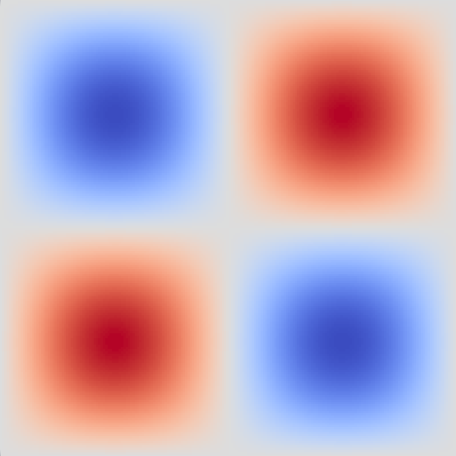
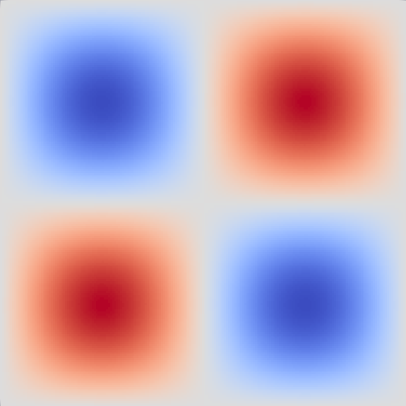
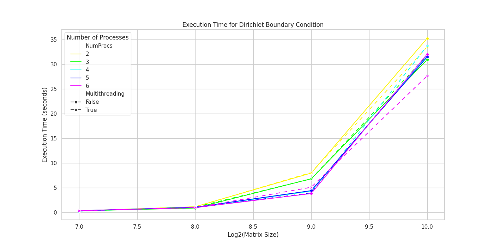
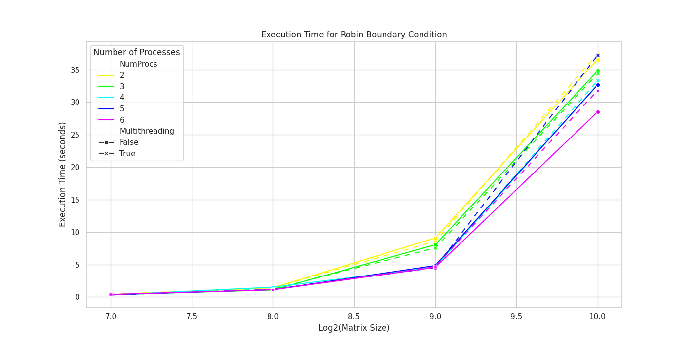
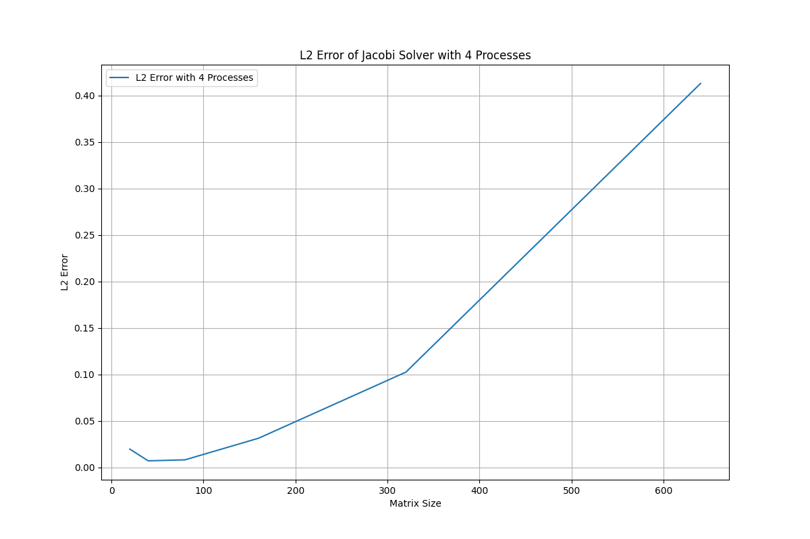

# LaplaceParallelSolver
A high-performance parallel solver for the Laplace equation using Jacobi iteration. This project utilizes C++, MPI for distributed computing, OpenMP for shared memory parallelism and Pybind11 for the binding in python. The solver is designed to handle large-scale problems efficiently by leveraging hybrid parallelism.


## Features

- Parallel implementation using MPI and OpenMP
- Supports Dirichlet and Robin boundary conditions
- Supports a python binding through Pybind11


## Prerequisites
- C++ Compiler
- MPI library (e.g., OpenMPI)
- OpenMP
- Python (for PyBind integration)
- CMake
- `PACS_ROOT` variable pointing to PACS examples folder
- python: `numpy` `pandas` `matplotlib` `seaborn`

## Instantiation and Testing

1. Clone the repository:
   ```sh
   git clone https://github.com/NiccoGrillo/LaplaceParallelSolver.git
   cd LaplaceParallelSolver 
   ```


2. Compile the code:
   ```sh
    module load eigen
    cd src/
    make
   ```


To run the solver basic test, use the following command:
```sh
mpirun -np <number_of_processes> ./solver <size_matrix> <multi_processing[bool]>
```

This test will run tests for both the Dirichlet and the Robin boundary conditions. 

Instead if one wanted to reproduce the results found in `./data/performance_results.csv` just run:
```sh
source loop.sh
```


## Pybind11 Integration

This project includes a Python interface using PyBind11. This allows you to interact with the solver from Python scripts.

### Building the Python Module

1. Install PyBind11:
   ```sh
   module load pybind11
   source $(PACS_ROOT)/../Extras/pybind11/install_PACS.sh
   ```

2. Compile the Python module:
   ```sh
   cd pybind
   make
   ```
3. Run the python script:
    ```sh
    python test_solver.py
    ```
Notes: it seems like in my implementtion there is a bit of overhead by using MPI and Pybind11 together. This is why I used the shell script to compute the official testings (they were too unreliable if done through python).


## Results and some notes
With $300^2$ grid points and Dirichlet conditions we get the following. On the left the exact solution, on the right the Jacobi approximation. 

<div style="display: flex; justify-content: space-around;">
    
    
</div>

### Performance results:
These graphs show how the time of computations increases by doubling the x and y axis of the grid. Multithreading in this case seems not to influence efficiency of the performance. 
<div style="display: flex; justify-content: space-around;">
    
    
</div>

### $L^2$-error with exact solution:

<div style="display: flex; justify-content: space-around;">
    
</div>


### Notes on choice of implementaion:
The reason why it was chosen to use template for the different boundary conditions is because, by knowing which type of boundary we are using at compile time (which seams reasonable), one could save computations. Indeed in the case of Dirichlet the boundary conditions just need to be applied once, while with Robin it is crucial to apply them at every iteration of the algorithm.
This saving in time can be seen by comparing the 2 plots above. 

## License
No license.